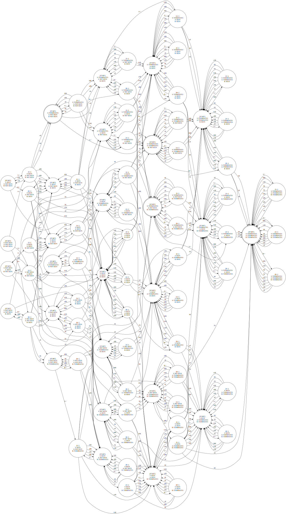

<!--toc:start-->
- [Задача 1](#задача-1)
- [Задача 2](#задача-2)
- [Задача 3](#задача-3)
- [Задача 4](#задача-4)
<!--toc:end-->

# Задача 1

$\{ w \mid (\exists v, z_1)(|v| > 0 \wedge (w = vvz_1 \lor w = z_1vv))\}, \Sigma = \{a, b\}$

Слово для накачки: $a^n b a^n b b$

Накачивая префикс из $a$ получаем $a^{i + n} b a^{n} b b$. В нем никак не расписать случай $z_1 vv$ из-за $bb$. Значит оно выходит из языка при $i \not = 0$ 

# Задача 2

Язык палиндромов, которые заодно не являются словами вида ww.

Слово $a^{n!+n} b^n a^{2n} b^n a^{n!+n}$

Накачка блоков b, ab, ba и крайних a выведет слово из палиндромов. Накачиваем серидину.

$a^{n!+n} b^n a^{2n -i + ik} b^n a^{n!+n}$

нужно найти такое k, что слово станет иметь вид ww:

$2(n! + n) = 2n - i + ik$

$2n! = - i + ik$

$2n! = i(k - 1)$

$k = \frac{2n!}{i} + 1$

деление факториала на i гарантированно будет целым (это же факториал). нашли k.

**НЕ КC**

# Задача 3

С помощью правила 2 раскрывая S из середины можно получить слово вида $(bb)^nb(ab)^n$. 
Нужно показать, что с используя эту грамматику никак нельзя получить слово вида $(bb)^kb(ab)^r$, где $k \not= r$ 

Методом исключения будем дропать правила из грамматики.
1. 3 правило сразу отбрасываем из-за трех ашек
2. 4 правило отбрасываем из-за того, что мы никак не получим b в самом начале из T. То есть это правило всегда генерит две ашки
3. отбрасываем 5 правило потому что оно всегда порождает abb в префиксе
4. 6 правило: вторая S в правеле всегда породит слово, которая кончится на b. Значит это правило всегда породит слово, которая кончится на bb, что непозволительно из-за ведущей ашки

В итоге осталось:

1. $S \rightarrow SbSaS$
2. $S \rightarrow Sbab$ (первое правило подставив T = ab)
3. $S \rightarrow b$

попробуем строить слова пытаясь получить $(bb)^kb(ab)^r$, где k, r - любые. Сначала заметим следующее:

1. слова, порожденные S всегда начинаются и кончаются на b
2. $\gamma Sb \theta$: не можем использовать правила 1 и 2 так как оба правила порождают ab на конце, а здесь сразу после S стоит b, что дает подстроку abb
3. $\gamma aS \theta$: не можем использовать правила 1 и 2 так как это даст строки $\gamma aSbSaS \theta$ и $\gamma aSbab \theta$ соответственно. Смотрим пункт 1 и понимаем, что это тупиковая ситуация из-за подстроки abb

Генерацию начнем с третьего правила: оно тупиковое и имеет целевой вид $(bb)^nb(ab)^n$ $(n = 0)$.
 
Пробуем второе: $Sbab$. Видим ситуацию из второго пункта замечаний. Тупик, $bbab$ не имеет целевой вид.

Пробуем первое: $SbSaS$. Применяем замечания 2 и 3 и получаем $bbSab$. Это слово будет иметь вид $(bb)^kb(ab)^r$ только если раскрытие внутреннего S будет иметь тот же вид. Повторяем рассуждение рекурсивно. База рекурсии - правило 3. В итоге мы только и строим слова вида $(bb)^nb(ab)^n$.

Мы показали, что есть правила, которые генерят только слова вида $(bb)^nb(ab)^n$ и не генерят $(bb)^kb(ab)^r$. Можем построить таблицу классов эквивалентности, которая покажет бесконечное их число. 

**Язык - КС**

# Задача 4

Автомат из 4 задачки (5 часов кода на питоне 🤢)

