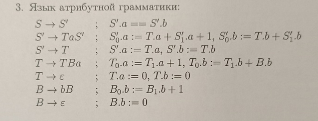
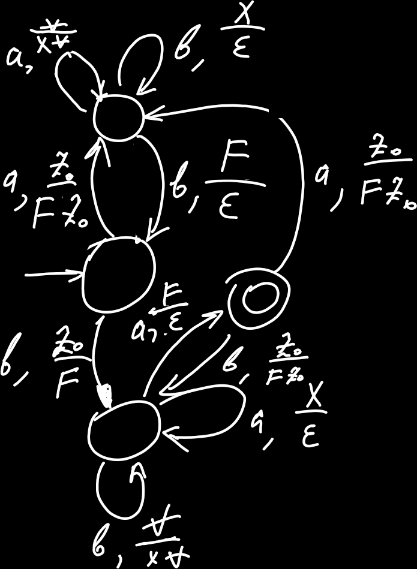

<!--toc:start-->
- [Вопрос 1](#вопрос-1)
- [Вопрос 2](#вопрос-2)
  - [Доказательство недетерминированности кс:](#доказательство-недетерминированности-кс)
- [Вопрос 3](#вопрос-3)
<!--toc:end-->

Вариант 26

# Вопрос 1

# Вопрос 2

$\{c^i a^n b^k c^j \vert k = n \wedge i + j > 1\}$

Грамматика:

$S \rightarrow S' \mid S''$

$S' \rightarrow cc S_1 \mid S_1 cc \mid c S_1 c$

$S_1 \rightarrow c S_1 \mid S_1 c \mid S_2$

$S_2 \rightarrow a S_2 \mid S_2 b \mid \epsilon$

$S'' \rightarrow  c S'' \mid S'' c \mid S_3$

$S_3 \rightarrow a S_3 b \mid \epsilon$

## Доказательство недетерминированности кс:
Возьмем 2 слова $w_1=a^n b^n$ и $w_2=a^n cc$ с общим префиксом $а^n$. 
Если в $w_1$ накачивать только префикс, оно выйдет из языка, если в $w_2$ 
накачивать часть префикса и часть суффикса отрицательной накачкой, 
оно выйдет из языка

# Вопрос 3

Грамматика описывает слова вида $((b^* a)^* a)^* (b^* a)^*$ с дополнительным условием на то что количество 
букв a должно быть равно количеству буки b.

Можно заметить, что регулярка на самом деле описывает $((a|b)^*a)?$, то есть все слова, заканчивающиеся на a.

Построенный DPDA:

Для нерегулярности построем таблицу классов эквивалентности для $b^n a^n$
