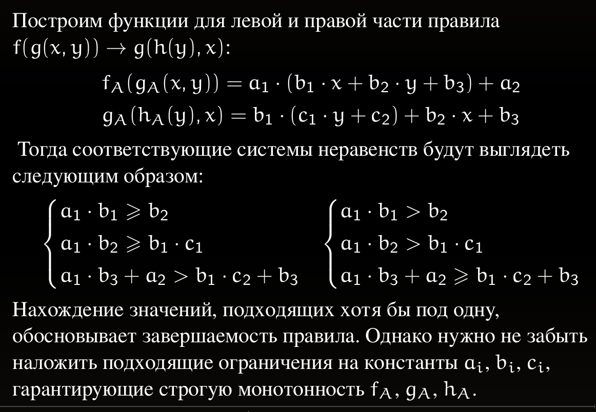
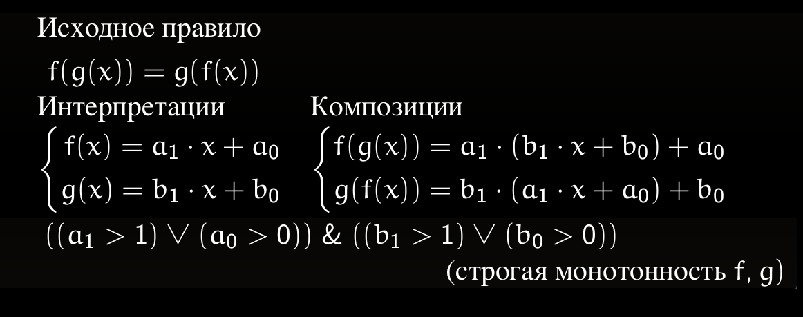

# Лабораторные работы по курсу "Теория Формальных Языков"

**Решения лежат в соответствующих git ветках**

Вариант 1

Выполнил: Слесарев Данила, ИУ9-51Б

# Компиляция

```bash
cargo build --release
```

Путь к скомпилированной программе: `./target/release/lab1`

Формулы переписывания принимаются через `stdin`.

Результат генерации выдаётся через `stdout`.

# Использование

* Генерация файла со спецификацией:

```bash
cat input.txt | ./target/release/lab1 > result.smt
```

* Прогон с z3:

```bash
cat input.txt | ./target/release/lab1 | z3 -in 
```

# Используемые неравенства

* Две системы связанные `or`



* Строгая монотонность




